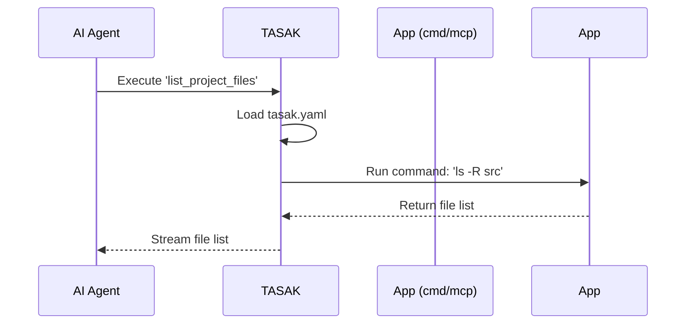

# TASAK: The Agent's Swiss Army Knife

**TASAK is a command-line proxy that allows AI agents to safely and effectively use predefined tools and applications within your local environment.**

It acts as a secure bridge, exposing simple commands (`cmd` apps), powerful AI-native servers (`mcp` apps), and composite workflows (`curated` apps) through a simple configuration file. The primary user of TASAK is an AI agent, which uses it as an interface to perform tasks on your behalf.

## Key Features

*   **AI-First:** Designed from the ground up as a tool for AI agents to interact with a local system.
*   **Declarative Configuration:** Define available applications and their settings in a simple `tasak.yaml` file.
*   **Hierarchical Config:** Merge global (`~/.tasak/`) and local (`./`) configurations for maximum flexibility.
*   **Three App Types:**
    *   `cmd`: Execute simple, one-off shell commands.
    *   `mcp`: Run persistent, AI-native servers using the **Model Context Protocol (MCP)** for advanced, stateful interactions.
    *   `curated`: Create composite APIs that orchestrate multiple tools into unified workflows.
*   **Secure:** You have full control over which commands and applications the AI agent can access.

## How It Works

1.  An **AI Agent** needs to perform a task on your machine (e.g., list files, check weather).
2.  It uses TASAK to discover and execute available "apps".
3.  TASAK reads its configuration (`tasak.yaml`) to find the requested app.
4.  It then runs the app, whether it's a simple command or a complex MCP server, and pipes the output back to the agent.



## Getting Started

### Installation


```bash
# Recommended: Install via pipx
pipx install git+https://github.com/jacekjursza/TASAK.git

# Alternative: Install directly
pip install git+https://github.com/jacekjursza/TASAK.git
```

### Configuration

1.  Create a global configuration file to define your most-used apps:

    ```bash
    mkdir -p ~/.tasak
    touch ~/.tasak/tasak.yaml
    ```

2.  Add your first app. For example, a simple command to list files:

    ```yaml
    # ~/.tasak/tasak.yaml
    header: "My Global TASAK Apps"

    apps_config:
      enabled_apps:
        - list_files

    list_files:
      name: "List Files"
      type: "cmd"
      meta:
        # This command will be executed when the AI calls 'list_files'
        command: "ls -la"
    ```

## Usage

Once configured, the AI agent can invoke the app by its name:

```bash
tasak list_files
```

TASAK will execute the `ls -la` command and return the output.

## Configuration in Depth

TASAK uses a hierarchical configuration system. It loads and merges YAML files in the following order, with later files overriding previous ones:

1.  **Global Config:** `~/.tasak/tasak.yaml`
2.  **Local Config (Hierarchical):** Searches upwards from the current directory for `.tasak/tasak.yaml` or `tasak.yaml`.

This allows you to define global tools (like a calculator) and project-specific tools (like a build script) separately.

### Example: App Types

Here is a more advanced `tasak.yaml` showcasing different app types.

```yaml
header: "Project-specific apps for MyWebApp"

apps_config:
  enabled_apps:
    - run_server
    - weather_service

# App Type: cmd
# A simple command to run the local development server.
run_server:
  name: "Run Webapp Server"
  type: "cmd"
  meta:
    command: "npm run dev"

# App Type: mcp
# A persistent MCP server providing weather data.
weather_service:
  name: "Weather MCP Service"
  type: "mcp"
  meta:
    command: "uv run /path/to/your/weather_server.py"
    env:
      OPENWEATHER_API_KEY: "${OPENWEATHER_API_KEY}"

# App Type: curated (NEW!)
# Composite API that orchestrates multiple tools
dev_workflow:
  name: "Development Workflow"
  type: "curated"
  commands:
    - name: "start"
      description: "Start all development services"
      backend:
        type: composite
        steps:
          - type: cmd
            command: ["docker-compose", "up", "-d"]
          - type: cmd
            command: ["npm", "run", "dev"]
```

## Documentation

For detailed documentation, see:
- [About TASAK](docs/final/00_about.md) - Overview and benefits
- [Installation & Setup](docs/final/01_setup.md) - Complete setup guide
- [Basic Usage](docs/final/02_basic_usage.md) - Creating simple `cmd` apps
- [Advanced Usage](docs/final/03_advanced_usage.md) - MCP servers, `curated` apps, and complex workflows

## For Developers

This project is built with Python and follows Test-Driven Development (TDD).

### Technical Requirements

*   Python 3.11+
*   Code must be clean, modular, and follow DRY principles.
*   All code, documentation, and comments must be in English.
*   Pre-commit hooks are used to enforce code quality (e.g., max 600 lines per file).

### Testing Notes (MCP E2E)

- E2E MCP scenarios are exercised via the `tasak` CLI using a local test server, not by spawning the MCP process directly.
- The test server code lives in `tests/e2e/mini-apps/simple_mcp_server.py` and is wired through `tests/e2e/test-mcp.json` and `tests/e2e/tasak_test_config.yaml`.
- A previously duplicated “direct MCP process” test was removed for stability; coverage remains in `tests/e2e/test_mcp_apps.py`.
- Run all tests: `pytest -q` (or target E2E: `pytest -q tests/e2e/test_mcp_apps.py`).
