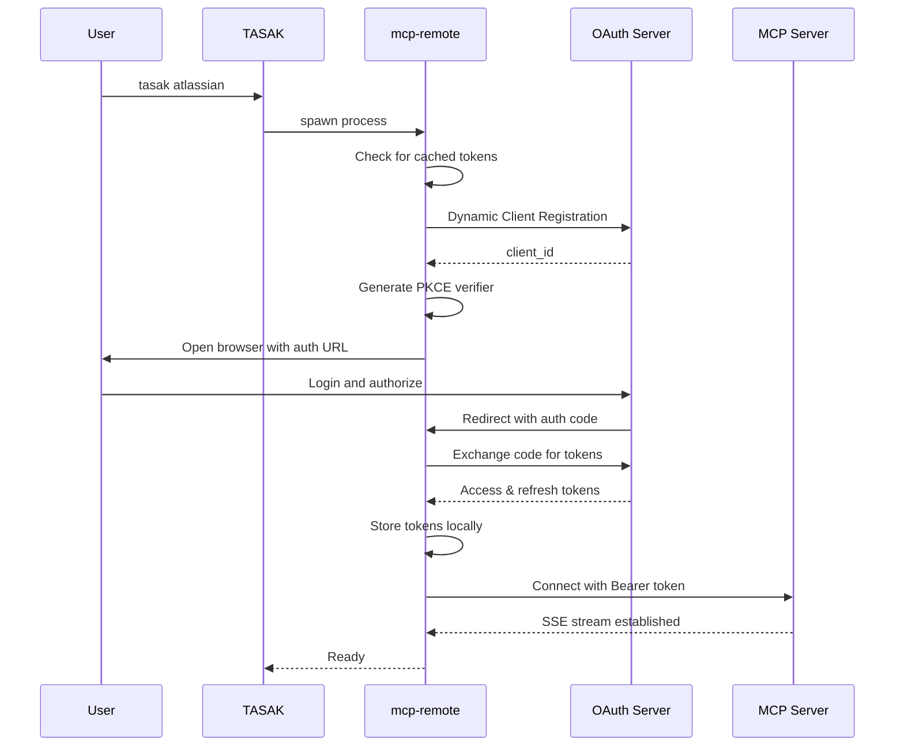
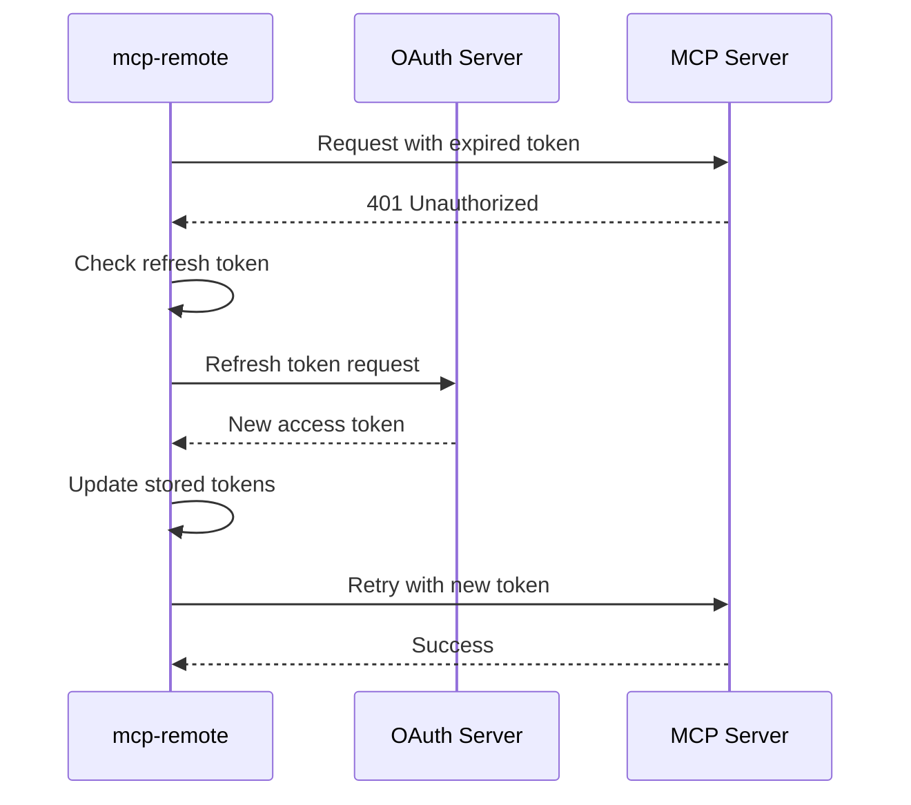

# MCP-Remote Architecture

## Overview

MCP-Remote is a proxy layer that bridges the gap between local MCP clients and remote OAuth-protected MCP servers. It handles the complexity of OAuth 2.1 authentication flows, token management, and secure communication.

## Architecture Components

```
┌─────────────┐       ┌──────────────┐       ┌─────────────┐       ┌──────────────┐
│   TASAK     │──────►│  mcp-remote  │──────►│OAuth Server │──────►│  MCP Server  │
│  (Client)   │       │   (Proxy)    │       │(auth.*.com) │       │(mcp.*.com)   │
└─────────────┘       └──────────────┘       └─────────────┘       └──────────────┘
     Local                  Local                  Remote                Remote
```

## Key Components

### 1. TASAK (Client Layer)
- Initiates connection via `npx mcp-remote`
- Passes server URL and configuration
- Receives proxied MCP responses

### 2. mcp-remote (Proxy Layer)
- **OAuth Client**: Implements OAuth 2.1 with PKCE
- **Token Manager**: Stores and refreshes tokens
- **SSE Client**: Maintains Server-Sent Events connection
- **MCP Translator**: Converts between local and remote protocols

### 3. OAuth Server
- Provides authentication endpoints
- Issues and validates tokens
- Manages client registration (dynamic or static)

### 4. MCP Server
- Actual service providing MCP capabilities
- Validates Bearer tokens
- Executes tools and returns results

## Authentication Flow

### Initial Authentication



### Token Refresh Flow



## Token Storage

### Location
```
~/.mcp-auth/mcp-remote-{version}/
├── {hash}_tokens.json
├── {hash}_client_info.json
└── {hash}_code_verifier.txt
```

### Hash Generation
- Based on server URL
- Ensures separate tokens per server
- Format: SHA256(server_url)

### Token Structure
```json
{
  "access_token": "eyJhbGciOiJ...",
  "refresh_token": "eyJhbGciOiJ...",
  "expires_in": 3600,
  "token_type": "Bearer",
  "scope": "read:jira write:jira"
}
```

## Security Features

### OAuth 2.1 Compliance
- **PKCE Required**: Protection against code interception
- **No Implicit Flow**: Only authorization code flow
- **Refresh Tokens**: Automatic token renewal

### Token Security
- **Local Storage Only**: Tokens never transmitted to TASAK
- **User Permissions**: Files are 600 (user-only read/write)
- **Automatic Cleanup**: Expired tokens are purged

### Transport Security
- **HTTPS Only**: All OAuth communication over TLS 1.2+
- **SSE over HTTPS**: Secure event streaming
- **Certificate Validation**: Full chain verification

## Protocol Details

### SSE Transport
```http
GET /v1/sse HTTP/1.1
Host: mcp.example.com
Authorization: Bearer {token}
Accept: text/event-stream
Cache-Control: no-cache
```

### Event Format
```
event: tool_call
data: {"tool": "search", "params": {...}}

event: result
data: {"status": "success", "data": {...}}
```

### Error Handling
- **401**: Token expired → Refresh
- **403**: Insufficient scope → Re-auth
- **429**: Rate limit → Backoff
- **500**: Server error → Retry with backoff

## Implementation in TASAK

### Configuration
```yaml
app_name:
  type: "mcp-remote"
  meta:
    server_url: "https://mcp.example.com/v1/sse"
    args: ["--verbose"]  # Optional mcp-remote flags
```

### Runner Module (`mcp_remote_runner.py`)
```python
def run_mcp_remote_app(app_name, app_config, app_args):
    # 1. Extract server URL from config
    # 2. Build npx command
    # 3. Spawn mcp-remote process
    # 4. Handle authentication if needed
    # 5. Proxy I/O between TASAK and mcp-remote
```

### Process Management
- **Spawn**: Using `subprocess.run()`
- **Interactive**: Maintains stdin/stdout/stderr
- **Signals**: Forwards SIGINT/SIGTERM
- **Cleanup**: Ensures process termination

## Comparison with Direct MCP

| Feature | Direct MCP | MCP-Remote |
|---------|------------|------------|
| **Location** | Local subprocess | Remote server |
| **Auth** | None/Simple | OAuth 2.1 |
| **Transport** | stdio/pipes | SSE/HTTP |
| **Token Mgmt** | N/A | Automatic |
| **Use Case** | Local tools | Cloud services |

## Limitations

### Current Limitations
1. **Interactive Only**: Requires browser for initial auth
2. **Localhost Callback**: Port 5598 must be available
3. **Node.js Required**: Uses npx for execution
4. **No Headless Mode**: Can't run in CI/CD easily

### Planned Improvements
1. **Service Accounts**: Pre-authenticated tokens
2. **Alternative Callbacks**: Device flow for headless
3. **Connection Pooling**: Reuse across commands
4. **Native Integration**: Direct implementation without npx

## Best Practices

### For Users
1. **First Run**: Ensure browser access for OAuth
2. **Token Expiry**: Let mcp-remote handle refresh
3. **Multiple Servers**: Each needs separate auth
4. **Troubleshooting**: Check `~/.mcp-auth/` for issues

### For Developers
1. **Error Handling**: Detect auth failures gracefully
2. **Timeout Management**: Set reasonable limits
3. **Process Cleanup**: Ensure no orphaned processes
4. **Logging**: Use `--verbose` for debugging

## References

- [MCP Specification](https://modelcontextprotocol.io/)
- [OAuth 2.1 Draft](https://datatracker.ietf.org/doc/html/draft-ietf-oauth-v2-1)
- [SSE Specification](https://html.spec.whatwg.org/multipage/server-sent-events.html)
- [mcp-remote NPM](https://www.npmjs.com/package/mcp-remote)
