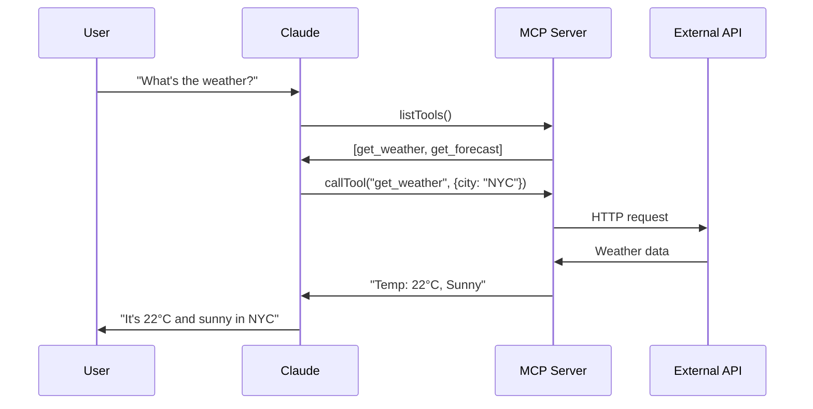

# Model Context Protocol (MCP) - BUILD & USE Guide

## Executive Summary

MCP (Model Context Protocol) to standardowy protokół umożliwiający LLM-om bezpieczne interakcje z zewnętrznymi systemami. Działa jak API, ale zaprojektowane specjalnie dla AI. Serwery MCP udostępniają dane (Resources), funkcje (Tools) i szablony (Prompts) w sposób zrozumiały dla modeli językowych.

---

# CZĘŚĆ I: BUILD - Tworzenie Serwerów MCP

## Architektura MCP

### Komponenty Systemu
```
┌─────────────┐     JSON-RPC      ┌─────────────┐
│  MCP Client │ ←────────────────→ │  MCP Server │
│  (np. LLM)  │                    │  (Twój kod) │
└─────────────┘                    └─────────────┘
       ↑                                   ↓
       │                            ┌──────────────┐
┌─────────────┐                     │   Resources  │
│  MCP Host   │                     │     Tools    │
│(np. Claude) │                     │    Prompts   │
└─────────────┘                     └──────────────┘
```

### Trzy Typy Capability

1. **Resources** - Dane tylko do odczytu (jak GET endpoints)
   - Pliki, dokumenty, dane strukturalne
   - Ładowane do kontekstu LLM
   
2. **Tools** - Funkcje wykonywalne (jak POST endpoints)
   - Wymagają zgody użytkownika
   - Mogą modyfikować stan systemu
   
3. **Prompts** - Szablony interakcji
   - Predefiniowane wzorce zapytań
   - Parametryzowane prompty

---

## FastMCP - Pythonowy Framework (Preferowany)

### Podstawowa Struktura Serwera

```python
from mcp.server.fastmcp import FastMCP
import asyncio

# Inicjalizacja serwera
mcp = FastMCP("my-server")

# Definiowanie Tool
@mcp.tool()
async def calculate_sum(a: int, b: int) -> str:
    """Calculate the sum of two numbers."""
    return f"The sum of {a} and {b} is {a + b}"

# Definiowanie Resource
@mcp.resource("config://settings")
async def get_settings() -> str:
    """Get current server settings."""
    return json.dumps({"theme": "dark", "lang": "en"})

# Definiowanie Prompt
@mcp.prompt()
async def code_review_prompt(language: str = "python") -> str:
    """Generate a code review prompt."""
    return f"Review this {language} code for best practices..."

# Uruchomienie
if __name__ == "__main__":
    mcp.run(transport='stdio')  # lub 'sse' dla HTTP
```

### FastMCP 2.0 - Zaawansowane Funkcje

```python
# Authentication
@mcp.tool(require_auth=True)
async def sensitive_operation(data: str) -> str:
    """Operation requiring authentication."""
    # ...

# Structured Output (2025+)
@mcp.tool()
async def get_data() -> tuple[str, dict]:
    """Return both text and structured data."""
    content = "Operation completed"
    structured = {"status": "success", "items": 10}
    return content, structured  # Backwards compatible

# Session Management
@mcp.tool()
async def stateful_operation(session_id: str) -> str:
    """Operation with session state."""
    state = mcp.get_session_state(session_id)
    # ...

# Progress Updates
@mcp.tool()
async def long_operation() -> str:
    """Long running operation with progress."""
    for i in range(100):
        await mcp.emit_progress(f"Processing: {i}%")
        await asyncio.sleep(0.1)
    return "Complete!"
```

### Wzorzec: Kompletny Weather Server

```python
from mcp.server.fastmcp import FastMCP
import httpx
import logging

# CRITICAL: Logging tylko do stderr!
logging.basicConfig(
    level=logging.INFO,
    format='%(asctime)s - %(levelname)s - %(message)s',
    handlers=[logging.StreamHandler()]  # stderr domyślnie
)

mcp = FastMCP("weather")

# Cache dla wydajności
_weather_cache = {}

@mcp.tool()
async def get_weather(
    city: str, 
    country_code: str = "US",
    units: str = "metric"
) -> str:
    """
    Get current weather for a city.
    
    Args:
        city: City name
        country_code: ISO country code
        units: metric or imperial
    """
    cache_key = f"{city}_{country_code}_{units}"
    
    # Check cache (5 min TTL)
    if cache_key in _weather_cache:
        cached_time, data = _weather_cache[cache_key]
        if time.time() - cached_time < 300:
            return data
    
    # Fetch fresh data
    async with httpx.AsyncClient() as client:
        response = await client.get(
            f"https://api.openweathermap.org/data/2.5/weather",
            params={
                "q": f"{city},{country_code}",
                "units": units,
                "appid": os.getenv("OPENWEATHER_API_KEY")
            }
        )
        
    if response.status_code == 200:
        data = response.json()
        result = f"""
Weather in {data['name']}, {data['sys']['country']}:
Temperature: {data['main']['temp']}°
Feels like: {data['main']['feels_like']}°
Description: {data['weather'][0]['description']}
Humidity: {data['main']['humidity']}%
Wind: {data['wind']['speed']} m/s
        """
        _weather_cache[cache_key] = (time.time(), result)
        return result
    else:
        return f"Error fetching weather: {response.status_code}"

@mcp.resource("weather://forecast/{city}")
async def get_forecast(city: str) -> str:
    """Get 5-day forecast as a resource."""
    # Implementation...
    
if __name__ == "__main__":
    mcp.run()
```

---

## TypeScript SDK - Alternatywa

### Podstawowa Struktura

```typescript
import { McpServer } from '@modelcontextprotocol/sdk';

const server = new McpServer({
  name: "my-server",
  version: "1.0.0"
});

// Tool definition
server.addTool({
  name: "calculate_sum",
  description: "Calculate sum of two numbers",
  inputSchema: {
    type: "object",
    properties: {
      a: { type: "number" },
      b: { type: "number" }
    },
    required: ["a", "b"]
  },
  handler: async ({ a, b }) => {
    return {
      content: `Sum is ${a + b}`
    };
  }
});

// Resource definition
server.addResource({
  uri: "config://settings",
  name: "Settings",
  handler: async () => {
    return {
      content: JSON.stringify({ theme: "dark" })
    };
  }
});

// Start server
server.start();
```

---

## Best Practices dla BUILD

### 1. Obsługa I/O
```python
# ❌ NIGDY nie rób tego
print("Debug info")  # Zepsuje protokół!

# ✅ Zawsze używaj loggingu
import logging
logger = logging.getLogger(__name__)
logger.info("Debug info")  # Do stderr
```

### 2. Error Handling
```python
@mcp.tool()
async def risky_operation(param: str) -> str:
    """Operation that might fail."""
    try:
        result = await external_api_call(param)
        return f"Success: {result}"
    except ConnectionError:
        return "Error: Unable to connect to service"
    except Exception as e:
        logger.error(f"Unexpected error: {e}")
        return "Error: Operation failed"
```

### 3. Type Hints & Docstrings
```python
@mcp.tool()
async def process_data(
    input_file: str,  # Zawsze używaj type hints
    format: str = "json",  # Domyślne wartości
    validate: bool = True
) -> dict:  # Return type też
    """
    Process data file with validation.
    
    Args:
        input_file: Path to input file
        format: Data format (json, csv, xml)
        validate: Whether to validate data
        
    Returns:
        Processing results with statistics
    """
    # Implementation
```

### 4. Testing
```python
# test_server.py
import pytest
from mcp.testing import create_test_client

@pytest.mark.asyncio
async def test_calculate_sum():
    async with create_test_client("my_server.py") as client:
        result = await client.call_tool(
            "calculate_sum",
            {"a": 5, "b": 3}
        )
        assert "8" in result
```

---

## Deployment Patterns

### 1. Local Development
```bash
# Python
uv run my_server.py

# TypeScript
npm run dev
```

### 2. Production - Docker
```dockerfile
FROM python:3.11-slim
WORKDIR /app
COPY requirements.txt .
RUN pip install -r requirements.txt
COPY . .
CMD ["python", "server.py"]
```

### 3. Cloud Functions
```python
# Serverless deployment (AWS Lambda, Vercel, etc.)
from mcp.server.fastmcp import FastMCP
from mangum import Mangum  # ASGI adapter

mcp = FastMCP("serverless")
# ... tool definitions ...

# Lambda handler
handler = Mangum(mcp.asgi())
```

---

# CZĘŚĆ II: USE - Używanie Serwerów MCP

## Konfiguracja Klienta (Claude Desktop)

### Podstawowa Konfiguracja
```json
{
  "mcpServers": {
    "weather": {
      "command": "python",
      "args": ["/path/to/weather_server.py"],
      "env": {
        "OPENWEATHER_API_KEY": "your-key-here"
      }
    }
  }
}
```

### Konfiguracja z uv (Recommended)
```json
{
  "mcpServers": {
    "my-server": {
      "command": "uv",
      "args": [
        "--directory",
        "/absolute/path/to/server",
        "run",
        "server.py"
      ]
    }
  }
}
```

### Konfiguracja TypeScript
```json
{
  "mcpServers": {
    "ts-server": {
      "command": "node",
      "args": ["/path/to/dist/server.js"]
    }
  }
}
```

---

## Flow Interakcji



---

## Debugging & Troubleshooting

### Logi (macOS)
```bash
# Sprawdź logi MCP
tail -f ~/Library/Logs/Claude/mcp*.log

# Server logs
tail -f ~/Library/Logs/Claude/mcp_server_*.log
```

### Common Issues

1. **Server nie startuje**
   - Sprawdź ścieżkę absolutną w config
   - Verify Python/Node version
   - Check permissions

2. **Tools nie widoczne**
   - Restart Claude Desktop
   - Check server logs for errors
   - Verify tool decorators

3. **Timeout errors**
   - Increase timeout in config
   - Optimize server performance
   - Use caching

---

## Przykłady Użycia (User Perspective)

### Podstawowe Zapytania
```
User: "Check the weather in Warsaw"
Claude: [Uses get_weather tool] → "It's 18°C and cloudy in Warsaw"

User: "Calculate factorial of 10"
Claude: [Uses math_tool] → "10! = 3,628,800"
```

### Złożone Workflow
```
User: "Analyze my project structure and create documentation"
Claude: 
1. [Uses list_files tool]
2. [Uses read_file tool for each source file]  
3. [Uses create_documentation tool]
→ "Documentation created in docs/ folder"
```

---

## Security Considerations

### For BUILD
- **Validate all inputs** - Never trust user data
- **Rate limiting** - Prevent abuse
- **Sandbox operations** - Isolate risky operations
- **API key management** - Use environment variables

### For USE
- **Tool approval** - User must approve tool calls
- **Resource limits** - MCP enforces limits
- **Session isolation** - Each client gets own session
- **Audit logging** - Track all operations

---

## Ekosystem i Narzędzia

### Frameworki (2025)
- **FastMCP** (Python) - Oficjalny, najpopularniejszy
- **EasyMCP** (TypeScript) - Prosty w użyciu
- **FastAPI-MCP** (Python) - Integracja z FastAPI
- **Quarkus MCP** (Java) - Enterprise Java
- **Higress MCP** (Go) - High performance

### Integracje
- Claude Desktop
- VSCode (via extensions)
- JetBrains IDEs (planned)
- Cursor IDE
- Custom clients

### Przykładowe Serwery
- File system access
- Database queries
- Web scraping
- Git operations
- Docker management
- Kubernetes control
- Slack integration
- Google Drive access

---

## Podsumowanie

### BUILD - Kluczowe Punkty
1. **FastMCP** dla Pythona, **TypeScript SDK** jako alternatywa
2. **Type hints i docstrings** = automatyczne definicje
3. **Logging tylko do stderr**, nigdy stdout
4. **3 typy capability**: Resources, Tools, Prompts
5. **Testing** od początku

### USE - Kluczowe Punkty
1. Konfiguracja w `claude_desktop_config.json`
2. Absolutne ścieżki zawsze
3. Tools wymagają zgody użytkownika
4. Logi w `~/Library/Logs/Claude/`
5. Restart Claude po zmianach config

### Next Steps
- Zacznij od prostego serwera (np. math tools)
- Dodaj Resources gdy potrzebujesz danych
- Implementuj Prompts dla powtarzalnych zadań
- Deploy lokalnie, potem rozważ cloud

---

*Research Date: 2025-09-05*
*MCP Version: Spec 2025-06-18*
*FastMCP: 2.0*