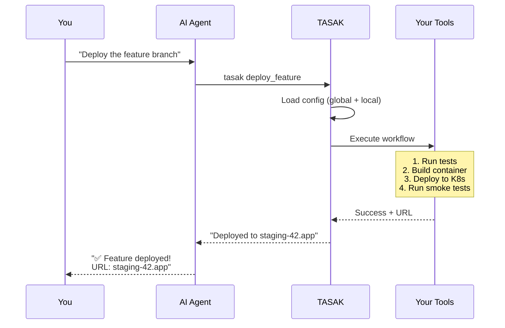

# TASAK: Unlock Your AI Agent's True Potential
## Contents

- [The Problem](#the-problem)
- [The TASAK Solution](#the-tasak-solution)
- [Who Benefits Most](#who-benefits-most)
- [Game-Changing Features](#game-changing-features)
- [Success Stories](#success-stories)
- [How It Works](#how-it-works)
- [Getting Started](#getting-started)

## The Problem

### 🤖 If You Use AI Coding Assistants (Claude Code, Cursor, Copilot)...

You've probably experienced:
- **Token waste**: Your AI rediscovers your project structure every conversation
- **Copy-paste hell**: Constantly moving commands between AI and terminal
- **Limited capabilities**: Your AI can't run your custom build scripts or tools
- **Context overload**: Explaining your workflow eats up valuable context window

### 👥 If You Manage a Development Team...

You're dealing with:
- **Inconsistent workflows**: Every developer has their own way of doing things
- **Painful onboarding**: New team members take weeks to learn all the tools
- **Documentation drift**: Your README is always out of sync with reality
- **"Works on my machine"**: Different environments, different problems

## The TASAK Solution

**TASAK transforms your AI assistant from a code generator into a complete development partner.**

Imagine if your AI could:
- ✅ Run your entire test suite with one command
- ✅ Deploy to staging environments
- ✅ Execute complex multi-step workflows
- ✅ Access project-specific tools and scripts
- ✅ Even write its own tools when needed!

TASAK makes this possible by creating a **curated command palette** that your AI agent can discover and execute safely.

## Who Benefits Most

### 🚀 **AI Power Users**
You're using Claude Code, Cursor, or Copilot daily and want to:
- **10x your productivity** by giving your AI real capabilities
- **Reduce token usage by 80%** through smart command discovery
- **Automate repetitive tasks** completely
- **Build an AI that learns** and improves your workflow

### 🏢 **Development Teams**
You're managing a team and need to:
- **Standardize workflows** across all developers
- **Accelerate onboarding** from weeks to hours
- **Ensure consistency** in how tasks are performed
- **Document by doing** - the commands ARE the documentation

### 🛠️ **DevOps Engineers**
You're maintaining infrastructure and want to:
- **Safely expose** production tools with guardrails
- **Create approval workflows** for sensitive operations
- **Reduce human error** in complex deployments
- **Enable self-service** for developers

### 📦 **Open Source Maintainers**
You're running a project and want to:
- **Make contributing easier** with standard commands
- **Reduce support burden** by eliminating setup issues
- **Attract AI-assisted contributions** to your project
- **Ensure reproducible** development environments

## Game-Changing Features

### 🧩 **Python Plugins - Your AI Can Code Its Own Tools!**

This is the killer feature nobody else has. Your AI agent can:
1. **Identify a missing tool** ("I need a way to format SQL queries")
2. **Write a Python plugin** on the spot
3. **TASAK loads it automatically**
4. **Use it immediately** in the same conversation!

```python
# Your AI just wrote this and can use it right away!
def smart_migrate(version: str):
    """Run database migrations with automatic backup"""
    backup_db()
    run_migrations(version)
    verify_schema()
    return "Migration complete!"
```

### 📊 **Context-Efficient Discovery**

Stop wasting tokens on repetitive explanations:
- **Before TASAK**: "To deploy, first run npm build, then docker build -t app:latest ., then kubectl apply -f k8s/, then..."
- **With TASAK**: "Run: tasak deploy"

**80% reduction in context usage** for common operations!

### 🎭 **Three Modes of Operation**

1. **`cmd` - Quick Commands**
   - Perfect for simple, one-off operations
   - Zero overhead, instant execution

2. **`mcp` - Stateful Services**
   - Run persistent servers (databases, APIs)
   - Maintain state across operations
   - Full Model Context Protocol support

3. **`curated` - Orchestrated Workflows**
   - Chain multiple operations together
   - Build complex pipelines
   - Add conditions and error handling

## How It Works



## Getting Started

### 🚀 **30-Second Setup**

```bash
# Install
pipx install tasak

# Configure your first tool
echo 'dev:
  type: cmd
  meta:
    command: "npm run dev"' > ~/.tasak/tasak.yaml

# Your AI can now start your dev server!
tasak dev
```

### 📚 **Learn More**

- **[Quick Setup Guide](setup.md)** - Get running in 2 minutes
- **[Creating Your First Apps](basic_usage.md)** - Build your command palette
- **[Advanced Features](advanced_usage.md)** - Python plugins, MCP servers, workflows
- **[Example Configurations](https://github.com/jacekjursza/TASAK/tree/main/examples)** - Real-world setups

### 💬 **Join the Community**

- Share your TASAK workflows
- Learn from other power users
- Get help with complex setups
- Contribute new features

**[GitHub Discussions →](https://github.com/jacekjursza/TASAK/discussions)**

---

**Ready to give your AI agent superpowers?**

→ **[Start with Installation](setup.md)**
