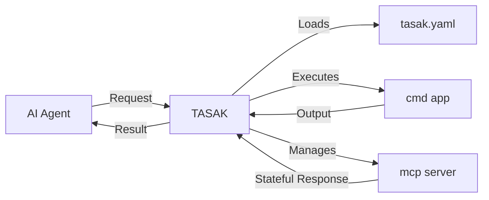

# TASAK: The Agent's Swiss Army Knife

## What is TASAK?

TASAK is a **command-line proxy** that serves as a secure bridge between AI agents and your local environment. It enables AI assistants to safely execute predefined tools and applications on your behalf, while maintaining full control over what can be accessed.

Think of TASAK as a **Swiss Army knife for AI agents** - a versatile toolkit that exposes carefully curated commands and services through a simple, declarative configuration system.

## Why TASAK?

### 🤖 **AI-First Design**
Built specifically for AI agents to interact with local systems safely and effectively. No more copy-pasting commands or manual execution - let the AI work directly with your tools.

### 🔒 **Security Through Control**
You define exactly which commands and applications are available. Every tool must be explicitly configured - nothing runs without your permission.

### ⚡ **Two Powerful App Types**
- **`cmd` apps**: Simple, one-off shell commands for quick tasks
- **`mcp` apps**: Persistent AI-native servers using Model Context Protocol for advanced, stateful interactions

### 🎯 **Hierarchical Configuration**
Flexible config system that merges global (~/.tasak/) and local (project-specific) settings. Define common tools globally, project-specific tools locally.

## Core Concept

## Real-World Use Cases

- **Development Automation**: Let AI agents run builds, tests, and deployments
- **File Management**: Safely browse, search, and organize files
- **Data Processing**: Execute scripts for data analysis and transformation
- **API Integration**: Connect to weather services, databases, or custom APIs
- **System Monitoring**: Check system status, logs, and metrics
- **Project Management**: Interact with Git, issue trackers, and CI/CD pipelines

## Key Benefits

✅ **Declarative**: Define tools in YAML, not code
✅ **Composable**: Mix and match tools for any workflow
✅ **Extensible**: Add new tools by editing configuration
✅ **Transparent**: See exactly what commands are being executed
✅ **Portable**: Works across different projects and environments

## Getting Started

TASAK transforms how AI agents interact with your local environment - from a risky, manual process to a secure, automated workflow. Ready to empower your AI assistant with real tools?

→ Continue to [Installation & Setup](01_setup.md)
