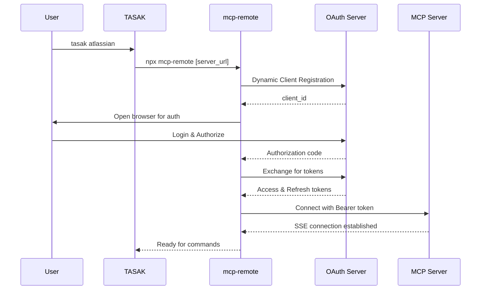

# MCP-Remote Applications

## What is MCP-Remote?

`mcp-remote` is an official npm package that acts as a **proxy bridge** between local MCP clients and remote MCP servers. It handles complex OAuth authentication flows and maintains persistent connections to cloud-based MCP servers.

### Key Features:
- **OAuth 2.1 Authentication**: Handles the complete OAuth flow including PKCE
- **Token Management**: Automatically stores and refreshes tokens
- **SSE Transport**: Maintains Server-Sent Events connections to remote servers
- **Dynamic Client Registration**: Automatically registers OAuth clients as needed

## Why MCP-Remote?

Many enterprise MCP servers (like Atlassian, GitHub, Slack) require:
- Complex OAuth 2.1 flows with PKCE
- Dynamic client registration
- Token refresh handling
- Secure token storage

Instead of implementing all this complexity in every client, `mcp-remote` provides a standardized proxy that handles it all.

## How It Works



## Configuration

### Basic Configuration

```yaml
# In tasak.yaml
atlassian:
  name: "Atlassian (Jira & Confluence)"
  type: "mcp-remote"
  meta:
    server_url: "https://mcp.atlassian.com/v1/sse"
```

### Advanced Configuration

```yaml
my_remote_mcp:
  name: "Custom Remote MCP Server"
  type: "mcp-remote"
  meta:
    server_url: "https://api.example.com/mcp/v1/sse"
    args:  # Additional arguments for mcp-remote
      - "--verbose"
      - "--timeout=30"
    tools:  # Document available tools
      - "Tool 1 description"
      - "Tool 2 description"
```

## Usage

### First Time Setup

```bash
# This will trigger OAuth authentication
tasak atlassian

# Or explicitly authenticate
tasak atlassian --auth
```

On first run:
1. Browser opens automatically
2. You log in to your Atlassian account
3. Approve the requested permissions
4. Tokens are saved locally in `~/.mcp-auth/`

### Subsequent Uses

After initial authentication, tokens are reused automatically:

```bash
# Uses cached tokens
tasak atlassian
```

### Token Storage

Tokens are stored by `mcp-remote` in:
```
~/.mcp-auth/mcp-remote-{version}/
├── {hash}_tokens.json        # Access & refresh tokens
├── {hash}_client_info.json   # OAuth client configuration
└── {hash}_code_verifier.txt  # PKCE verifier
```

The hash is based on the server URL to keep tokens separate for different servers.

## Supported Servers

### Official/Known Servers

| Server | URL | Description |
|--------|-----|-------------|
| Atlassian | `https://mcp.atlassian.com/v1/sse` | Jira, Confluence access |
| GitHub | `https://mcp.github.com/v1/sse` | Repository and issue management |
| Slack | `https://mcp.slack.com/v1/sse` | Workspace communication |

### Custom Servers

Any MCP server that:
- Implements OAuth 2.1 with PKCE
- Supports dynamic client registration
- Uses SSE transport

Can be configured as an `mcp-remote` app.

## Troubleshooting

### Node.js Not Found

```bash
Error: npx not found. Please install Node.js first.
```

**Solution**: Install Node.js from https://nodejs.org/

### Authentication Fails

```bash
Authentication may have failed or was cancelled.
```

**Possible causes**:
- Browser popup was blocked
- User cancelled the OAuth flow
- Network issues

**Solution**: Run `tasak [app_name] --auth` again

### Token Expired

If tokens expire, `mcp-remote` should automatically refresh them using the refresh token. If this fails, re-authenticate:

```bash
# Force re-authentication
rm -rf ~/.mcp-auth/mcp-remote-*/
tasak atlassian --auth
```

### Port Already in Use

```bash
Error: Port 5598 is already in use
```

**Solution**:
- Wait a moment and try again
- Check for stuck processes: `lsof -i :5598`

## How mcp-remote Differs from Direct MCP

### Direct MCP Apps (type: "mcp")
- Connect to local MCP servers
- Server runs as subprocess
- No OAuth required (or handled by TASAK)
- Example: Local Python MCP server

### MCP-Remote Apps (type: "mcp-remote")
- Connect to remote cloud servers
- Uses `npx mcp-remote` as proxy
- Handles complex OAuth flows
- Example: Atlassian, GitHub, Slack

## Security Considerations

1. **Token Storage**: Tokens are stored locally in `~/.mcp-auth/` with user-only permissions
2. **HTTPS Only**: All communication uses TLS 1.2+
3. **OAuth 2.1**: Modern security standards with PKCE
4. **Scoped Access**: Tokens are scoped to specific permissions
5. **Automatic Expiry**: Tokens expire and refresh automatically

## Implementation Details

### TASAK Integration

TASAK's `mcp_remote_runner.py` module:
1. Constructs the `npx mcp-remote` command
2. Passes the server URL and any additional arguments
3. Runs the proxy interactively
4. Handles authentication flows
5. Provides help and status information

### Requirements

- **Node.js**: Version 16+ recommended
- **npx**: Comes with Node.js (npm 5.2+)
- **Internet connection**: For OAuth and server access
- **Web browser**: For OAuth authorization

## Examples

### Example 1: Atlassian Integration

```yaml
# ~/.tasak/tasak.yaml
apps_config:
  enabled_apps:
    - jira

jira:
  name: "Jira Project Management"
  type: "mcp-remote"
  meta:
    server_url: "https://mcp.atlassian.com/v1/sse"
    tools:
      - "Search issues"
      - "Create tickets"
      - "Update status"
```

### Example 2: Multiple Remote Servers

```yaml
# Project-specific tasak.yaml
apps_config:
  enabled_apps:
    - atlassian
    - github
    - slack

atlassian:
  name: "Project Jira"
  type: "mcp-remote"
  meta:
    server_url: "https://mcp.atlassian.com/v1/sse"

github:
  name: "Project Repo"
  type: "mcp-remote"
  meta:
    server_url: "https://mcp.github.com/v1/sse"

slack:
  name: "Project Channel"
  type: "mcp-remote"
  meta:
    server_url: "https://mcp.slack.com/v1/sse"
```

## Future Enhancements

Potential improvements for mcp-remote integration:

1. **Headless Authentication**: For CI/CD environments
2. **Token Sharing**: Between multiple TASAK installations
3. **Custom Callbacks**: Alternative to localhost callbacks
4. **Pre-authentication**: Using API tokens instead of OAuth
5. **Connection Pooling**: Reuse connections across commands

## References

- [MCP Remote NPM Package](https://www.npmjs.com/package/mcp-remote)
- [Model Context Protocol Specification](https://modelcontextprotocol.io/)
- [OAuth 2.1 Specification](https://oauth.net/2.1/)
- [Atlassian MCP Documentation](https://support.atlassian.com/rovo/docs/atlassian-remote-mcp-server/)
